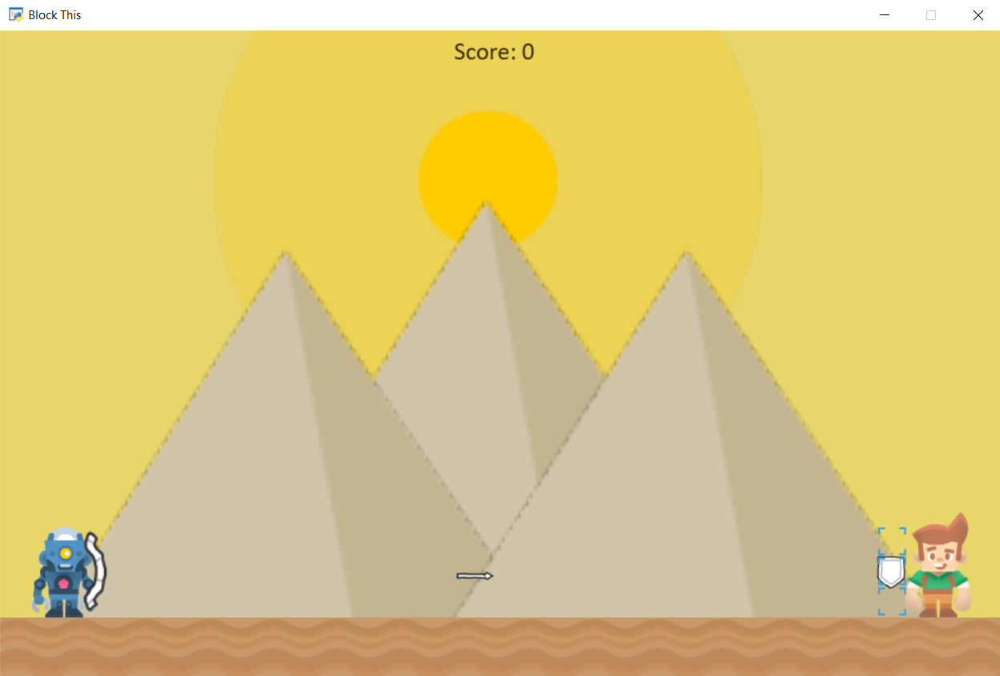

# BlockThis
Try blocking as many arrows from the evil robot guarding the pyramid tomb with your shield. Careful, you only have one chance to place your shield in the correction postion to protect your head, body or legs everytime a single arrow is shot.
# Installation
$ git clone https://github.com/kian466/BlockThis.git 
#
to copy the files such as sprite png's and the video game code onto your local computer. A Background draft is also included to show our beginning steps of creating this game. (Note: May have to slightly change pathway of the sprite images in BlockThis.py to your own local desktop to run game)
# Instructions
A robot is about to randomly shoot an arrow at you, use your mouse to click in one out of the three square areas to place your shield in and see if you guess correctly on which box the robot will shoot in. Guess right and you are awarded with +1 point = 1 Treasure. Guess wrong and your score will reset. 
# Acknowledgements
This game was created between collaborating team members Leah Hong, Michael May, and Kian Shain; with also the assistance of our GSI Nick Cinko.

# 
